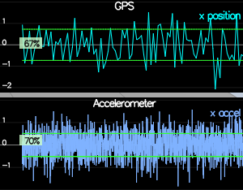
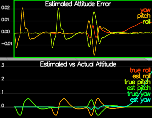
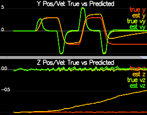
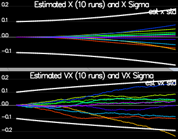
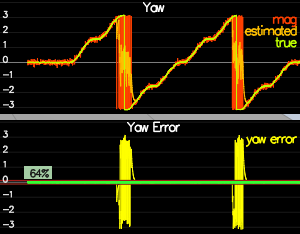
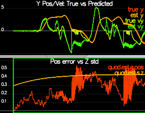
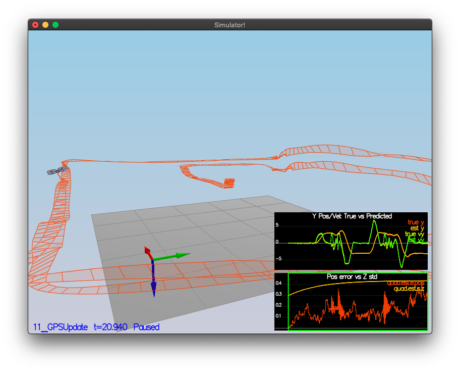
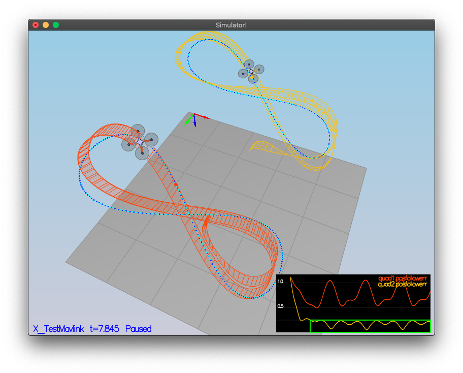
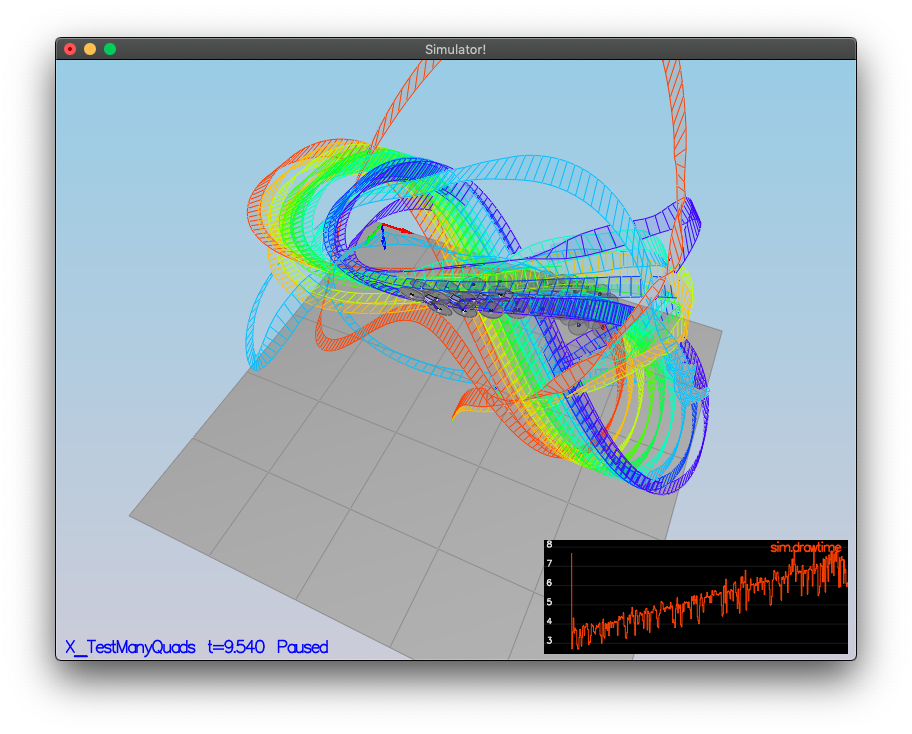

# Estimation Project #

## The Tasks ##

Project outline:

 - [Step 1: Sensor Noise](#step-1-sensor-noise)
 - [Step 2: Attitude Estimation](#step-2-attitude-estimation)
 - [Step 3: Prediction Step](#step-3-prediction-step)
 - [Step 4: Magnetometer Update](#step-4-magnetometer-update)
 - [Step 5: Closed Loop + GPS Update](#step-5-closed-loop--gps-update)
 - [Step 6: Adding Your Controller](#step-6-adding-your-controller)


### Step 1: Sensor Noise ###

This step added sensor noise into the ideal drone. The standard deviation of the original logged data was processed from `06_NoisySensors` and then used for input in `config/6_Sensornoise.txt` for  the values of `MeasuredStdDev_GPSPosXY` and `MeasuredStdDev_AccelXY` .




### Step 2: Attitude Estimation ###

This step used scenario `07_AttitudeEstimation` for completing the code in `QuadEstimatorEKF.cpp`, function `UpdateFromIMU()` of a complementary filter-type attitude filter. The final drone passed with an attitude estimator within the required 0.1 rad for the Euler angles for 3 seconds.




### Step 3: Prediction Step ###

The state prediction step of the Kalman filter was implemented in this step using scenario `08_PredictState` to test editting of the `PredictState()` functon in `QuadEstimatorEKF.cpp` when the accelerometer was rendered insignificant by setting `QuadEstimatorEKF.attitudeTau = 100` to get the following image:



Then a more realistic scenario with IMU noise was tested using scenario `09_PredictionCov` and updating function `GetRbgPrime()` and `Predict()` in `QuadEstimatorEKF.cpp`.

The final plots capture the original rubric points comparing the given plot where the estimator state track the actual state, with only reasonably slow drift, as shown in the figure below:


with the created plot:




### Step 4: Magnetometer Update ###

In this step the magnetometer update was implemented in the function `UpdateFromMag()` in `QuadEstimatorEKF.cpp` after tuning of the `QYawStd` in `QuadEstimatorEKF.txt`.

The final scenario maintained the error in the standard deviation of less than 0.1 rad in heading for 10 seconds as shown below:




### Step 5: Closed Loop + GPS Update ###

This scenarion (`11_GPSUpdate`), added the final GPS sensor into the Extended Kalman filter after adding in a more realistic IMU by changing several lines in `config/11_GPSUpdate.txt` to:
```
`Quad.UseIdealEstimator = 0`
#SimIMU.AccelStd = 0,0,0
#SimIMU.GyroStd = 0,0,0
```

and tuning the parameters in `QuadEstimatorEKF.txt`. 
The final simulation passed the entire simulation cycle with an estimated position error of under 0.5 meters.




### Step 6: Adding Your Controller ###

In this last step, previously implemented code from https://github.com/cimoody/FCND-Controls-CPP was used to replace the project files `QuadController.cpp` and `QuadControlParams.txt`.

Amazingly, it passed the simulation cycle in scenario `11_GPSUpdate` with estimated position error of less than 1 meter on the first try:



Several other scenarios were tested and are shown here for the authors amusement:

Figure Eights:



Many Quad-copters:




## Submission ##

Sumbitting:

 - a completed estimator that meets the performance criteria for each of the steps by submitting:
   - `QuadEstimatorEKF.cpp`
   - `config/QuadEstimatorEKF.txt`

 - a re-tuned controller that, in conjunction with your tuned estimator, is capable of meeting the criteria laid out in Step 6 by submitting:
   - `QuadController.cpp`
   - `config/QuadControlParams.txt`

 - a write up addressing all the points of the rubric


## Authors ##

README by cimoody.

Thanks to fellow student nominator for debugging help.

Thanks to Udacity and Fotokite for the initial development of the project code and simulator.